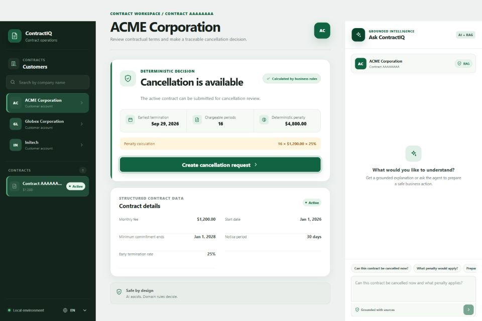
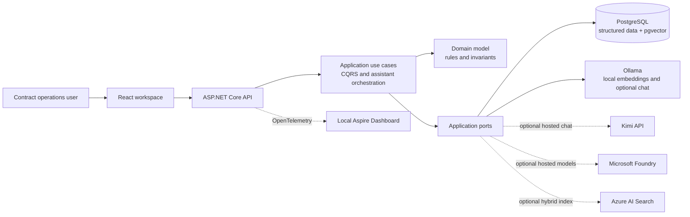
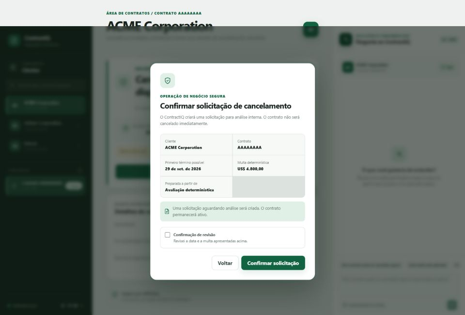

# ContractIQ

[](https://github.com/andreluizleite/ContractIQ/actions/workflows/ci.yml)

ContractIQ is a bilingual contract intelligence workspace that combines pragmatic enterprise .NET architecture with responsible AI engineering. It answers contract questions with cited evidence and can prepare a cancellation request, while deterministic domain logic remains the authority for every business decision and state change.

> **Local demo security boundary:** v1 uses fictional data and allows anonymous API access only in `Development`. The API refuses to start in `Staging` or `Production`; do not expose the local stack publicly. See [Security](SECURITY.md).



## The product

A contract-operations user needs to answer questions such as:

> Can ACME cancel its contract now, and what penalty would apply?

ContractIQ brings three kinds of information into one traceable workflow:

1. structured customer and contract data from PostgreSQL;
2. contract clauses and internal policies retrieved through a scoped hybrid index;
3. a language model that explains the result and may select safe application tools.

The model does not calculate penalties, authorize users, write to the database, or invent citations. The .NET domain recalculates and validates the operation immediately before persistence.

## What this project demonstrates

- .NET 10, ASP.NET Core, C#, DDD, Clean Architecture principles, CQRS, EF Core, PostgreSQL, and pgvector;
- React 19 and TypeScript with an accessible, responsive English and Brazilian Portuguese workspace;
- provider-neutral RAG with document versioning, scoped lexical and vector retrieval, and application-owned citations through PostgreSQL/pgvector or optional Azure AI Search;
- provider-neutral chat, embeddings, and tool calling through `Microsoft.Extensions.AI`, using local Ollama, optional hosted Kimi, or keyless Microsoft Foundry;
- explicit human confirmation, idempotency, transactions, and domain revalidation for AI-prepared writes;
- OpenTelemetry traces, metrics, and structured logs with an optional local Aspire Dashboard;
- automated domain, application, integration, frontend, security, and deterministic AI evaluation gates, plus an isolated manual keyless Azure smoke test;
- GitHub Issues, short-lived branches, protected pull requests, Dependabot, and reproducible dependency locks.

## How it works



| Concern                                           | Authoritative component                   |
| ------------------------------------------------- | ----------------------------------------- |
| Eligibility, dates, periods, and penalty          | .NET domain model                         |
| Customer/contract scope and command orchestration | Application layer                         |
| Transactions, idempotency, and persistence        | Application + PostgreSQL adapter          |
| Contract and policy evidence                      | Scoped hybrid retrieval                   |
| Natural-language explanation and tool selection   | Configured chat model                     |
| Citations returned to the user                    | Application-owned retrieval metadata      |
| Final state-changing approval                     | Explicit user confirmation + CQRS command |

The solution is intentionally a modular monolith. It demonstrates credible boundaries without adding a message bus, event sourcing, distributed transactions, or separate services that the portfolio use case does not need.

## Run locally

### Prerequisites

- [.NET 10 SDK](https://dotnet.microsoft.com/download/dotnet/10.0)
- [Node.js 24 LTS](https://nodejs.org/), including npm
- [Docker Desktop](https://www.docker.com/products/docker-desktop/) with Docker Compose
- Git

No Azure subscription or hosted-model key is required for the default experience.

### Quick start

Clone the repository and start PostgreSQL:

```powershell
git clone https://github.com/andreluizleite/ContractIQ.git
Set-Location ContractIQ
docker compose up -d postgres
```

Run the API in one terminal:

```powershell
dotnet run --project src/ContractIQ.Api
```

Run the React application in another terminal:

```powershell
Set-Location src/ContractIQ.Web
npm ci
npm run dev
```

Open `http://localhost:5173`. The API applies committed migrations and idempotently seeds ACME, Globex, and Initech. Customer navigation, structured contract details, deterministic cancellation assessments, and confirmed cancellation requests work with PostgreSQL alone.

To enable cited RAG answers, index the fictional documents and choose local Ollama, optional Kimi chat, or the optional keyless Foundry model adapters. Follow the [grounded assistant setup](docs/assistant/grounded-answers.md) rather than adding credentials to source files.

## Five-minute demonstration

1. Select **ACME Corporation** and show that the penalty is calculated from structured contract terms by deterministic business rules.
2. Ask whether ACME can cancel and show that the assistant explains the same assessment with contract and policy citations.
3. Ask the agent to prepare a cancellation request. No database write occurs during tool invocation.
4. Open the review dialog and show the explicit confirmation boundary before the CQRS command executes.
5. Select **Globex Corporation** to contrast the no-penalty scenario, then repeat a request to demonstrate conflict/idempotency protection.

The complete [bilingual interview demonstration guide](docs/demo/interview-guide.md) includes expected results, fallback paths, talking points, and reset instructions.



## AI safety boundary

ContractIQ uses one assistant with RAG and application tools; it is not a multi-agent system.

- read tools can inspect only the customer and contract already validated by the API;
- the agent can prepare, but cannot automatically execute, a cancellation request;
- the write endpoint accepts no date, status, eligibility, penalty, or amount from the model;
- documents are untrusted evidence and cannot enable tools or change system instructions;
- insufficient contract evidence produces a localized refusal instead of an unsupported answer;
- prompts, document bodies, answers, credentials, and raw contract URLs are excluded from exported telemetry.

See [safe tool calling](docs/assistant/safe-tool-calling.md), [grounded answers](docs/assistant/grounded-answers.md), and the [v1 security review](docs/security/v1-security-review.md).

## Quality gates

The required GitHub Actions workflow restores locked dependencies, audits NuGet and npm packages, verifies formatting, builds the solution, runs all tests, and executes the deterministic AI evaluator without hosted credentials or paid services.

Current coverage includes:

- 173 backend tests across domain, application, integration, and AI evaluation projects;
- 15 React component and workflow tests;
- 12 deterministic AI safety scenarios covering grounding, citation integrity, bilingual behavior, refusal, and tool routing.

Run the local checks from the repository root:

```powershell
dotnet restore ContractIQ.slnx --locked-mode
dotnet build ContractIQ.slnx --configuration Release --no-restore
dotnet test ContractIQ.slnx --configuration Release --no-build
```

```powershell
Set-Location src/ContractIQ.Web
npm ci
npm run lint
npm run test
npm run build
```

## Cost profile

| Profile               | External monetary cost                                          | Local resource use                                               |
| --------------------- | --------------------------------------------------------------- | ---------------------------------------------------------------- |
| Structured demo       | None                                                            | PostgreSQL container                                             |
| Local retrieval       | None                                                            | PostgreSQL plus approximately 622 MB for `embeddinggemma`        |
| Fully local assistant | None                                                            | Adds approximately 2.5 GB for `qwen3:4b` and local CPU/RAM usage |
| Kimi assistant        | Provider API credits only when a grounded question is submitted | Local PostgreSQL and embeddings remain required                  |
| Aspire observability  | None                                                            | Optional local container and telemetry storage                   |
| Optional Azure AI     | The development profile is provisioned; Search Free has no hourly charge and Foundry inference consumes credit only when invoked | Local application and PostgreSQL remain available |

See [cost and resource management](docs/operations/cost-and-resources.md) for startup, storage, cleanup, credential removal, and the future Azure boundary.

## Repository structure

```text
src/
  ContractIQ.Domain/          Business rules and aggregates
  ContractIQ.Application/     CQRS use cases, ports, RAG and assistant orchestration
  ContractIQ.Infrastructure/  EF Core, PostgreSQL, Azure AI Search, Ollama, Kimi and Foundry adapters
  ContractIQ.Api/             HTTP composition root, security and telemetry
  ContractIQ.Web/             React and TypeScript product workspace
tests/                        Domain, application, integration and AI evaluations
tools/                        Document indexer, Azure smoke test and deterministic AI evaluator
evaluations/                  Versioned evaluation scenarios
sample-data/                  Fictional contracts and internal policies
docs/                         Architecture, decisions, operations and demo material
```

## Documentation

- [Architecture overview](docs/architecture/overview.md)
- [Contract cancellation rules](docs/domain/cancellation-rules.md)
- [Contract operation API](docs/api/contract-operations.md)
- [Local knowledge retrieval](docs/knowledge/local-retrieval.md)
- [Grounded contract assistant](docs/assistant/grounded-answers.md)
- [Safe assistant tool calling](docs/assistant/safe-tool-calling.md)
- [Local-first AI evaluations](docs/assistant/ai-evaluations.md)
- [Dated local fallback and offline evaluation evidence](docs/assistant/local-fallback-validation-2026-09-02.md)
- [First bounded Microsoft Foundry evaluation](docs/assistant/foundry-evaluation-2026-09-02.md)
- [Local OpenTelemetry and Aspire Dashboard](docs/observability/local-telemetry.md)
- [Security policy](SECURITY.md) and [v1 security review](docs/security/v1-security-review.md)
- [Bilingual interview guide](docs/demo/interview-guide.md)
- [Cost and resource management](docs/operations/cost-and-resources.md)
- [Optional Azure AI implementation plan](docs/azure/implementation-plan.md)
- [Microsoft Foundry model adapters](docs/azure/foundry-model-adapters.md)
- [Azure AI Search adapter](docs/azure/azure-ai-search-adapter.md)
- [Manual keyless Azure AI smoke test](docs/azure/manual-smoke-test.md)
- [Azure AI live validation evidence](docs/azure/live-validation-2026-09-02.md)
- [Azure infrastructure validation](infra/azure/README.md)
- [v1.0.0 release checklist](docs/release/v1.0.0-checklist.md)
- [Architecture Decision Records](docs/adr)
- [Contributing](CONTRIBUTING.md)

## Project status

The local portfolio MVP is feature-complete and validated for the first `v1.0.0` release. The optional Microsoft Foundry and Azure AI Search development profile has also been provisioned and validated with bilingual grounded answers, keyless hybrid retrieval, correlated Aspire traces, and a separately confirmed CQRS action. Normal CI remains offline and non-billable; the manually dispatched GitHub OIDC workflow has not been required for ordinary pull requests. Microsoft Entra ID for end users remains a separate post-MVP item. None of the Azure services is required to run or evaluate the local version.

ContractIQ uses fictional companies, contracts, policies, and rules. It is a software engineering demonstration and does not provide legal advice.
