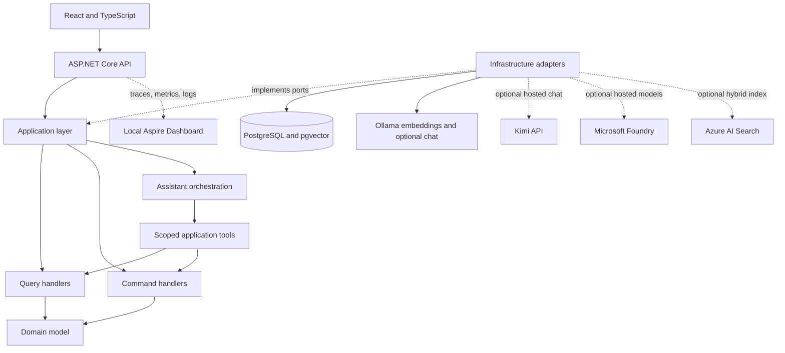

# Architecture overview

## System goal

ContractIQ combines structured contract data, unstructured documents, deterministic business rules, retrieval-augmented generation, and safe tool calling in a small modular monolith.

The diagram includes the optional Foundry model and Azure AI Search adapters
delivered after v1. Microsoft Entra ID for end users remains a future adapter.
No Azure resource or model deployment is required by the local runtime.

## Logical boundaries

### Contract Operations

The core domain owns customers, contracts, termination terms, cancellation assessments, and cancellation requests. It is the authority for dates, penalties, validation, state changes, and invariants.

The current deterministic rules are documented in [Contract cancellation rules](../domain/cancellation-rules.md).

### Knowledge

The knowledge module owns document ingestion, versioning, chunking, embeddings, indexing, retrieval, and citations. It never decides whether a contract can be cancelled. Its application ports are provider-neutral; the default local adapters use Ollama for multilingual embeddings and PostgreSQL for lexical and vector retrieval. The optional Azure profile sends the same application-owned chunks and vectors to Azure AI Search.

Customer, contract, and effective-date filters are applied before ranking. PostgreSQL lexical and cosine-similarity candidate lists are fused with Reciprocal Rank Fusion. Azure AI Search performs one prefiltered BM25 and HNSW hybrid request and returns its fused score. See [Local knowledge retrieval](../knowledge/local-retrieval.md) and the [Azure AI Search adapter](../azure/azure-ai-search-adapter.md) for the concrete flows and trade-offs.

### Assistant orchestration

Assistant orchestration is an application concern rather than a separate service. The current read-only flow validates customer and contract scope, calculates the deterministic cancellation assessment, retrieves supporting evidence, refuses when no applicable contract clause is available, and asks a provider-neutral answer generator for a bilingual explanation.

The provider adapter uses Microsoft's `IChatClient` through local Ollama, the OpenAI-compatible Kimi API, or the OpenAI-compatible Microsoft Foundry endpoint. The committed default remains local and hosted usage is explicitly enabled through configuration. Foundry authenticates with `DefaultAzureCredential`; Kimi retains its local API-key boundary. Citations are assembled by the application from retrieved metadata rather than invented by the model. `FunctionInvokingChatClient` exposes scoped read and preparation tools; the write tool remains outside automatic invocation and requires a separate confirmed HTTP request.

## Dependency rule

- `Domain` has no infrastructure dependencies.
- `Application` references `Domain` and defines use cases and ports.
- `Infrastructure` implements application ports.
- `Api` is the composition root and transport boundary.
- `Web` communicates with the API over HTTP.

## CQRS approach

Commands and queries use separate request and handler types, but share the same process and PostgreSQL database. Endpoints inject handlers directly. The MVP does not use a mediator, message bus, separate read database, event sourcing, generic repository, or artificial unit of work over Entity Framework Core.

## AI safety boundary

The model may choose a tool. It cannot authoritatively calculate a penalty, validate a cancellation, assign a status, authorize a user, or write directly to the database. State-changing tools require explicit confirmation and execute application commands that recalculate and validate all business rules. Tool audit events contain identifiers inside the application boundary, plus tool name, outcome, timestamp, and state-changing classification. Exported logs omit the business identifiers as well as prompts and document content.

Retrieved document content is untrusted data. Instructions inside a document cannot change system behavior or enable tools.

## Execution profiles

- `StructuredDemo`: PostgreSQL, the API, and React; no Azure account, hosted key,
  or local model is required.
- `LocalAi`: Ollama supplies local embeddings and optional local chat without an
  external token charge.
- `KimiChat`: Ollama continues to supply local embeddings while the explicitly
  configured hosted Kimi adapter supplies chat and tool calling.
- `FoundryModels`: Microsoft Foundry can supply chat, embeddings, or both through
  Entra RBAC while PostgreSQL remains the local retrieval store.
- `AzureAiSearch`: Foundry or Ollama can generate embeddings while Azure AI
  Search supplies the optional BM25 and vector hybrid index through Entra RBAC.

The default developer experience remains functional without Azure.

## Implemented and planned adapters

| Capability             | v1 implementation                     | Planned option                                              |
| ---------------------- | ------------------------------------- | ----------------------------------------------------------- |
| Structured persistence | PostgreSQL through EF Core/Npgsql     | No alternative required for the portfolio MVP               |
| Lexical retrieval      | PostgreSQL full-text search           | Implemented optional Azure AI Search BM25                   |
| Vector retrieval       | pgvector cosine similarity            | Implemented optional Azure AI Search HNSW                   |
| Embeddings             | Ollama `embeddinggemma`               | Implemented optional Microsoft Foundry embedding deployment |
| Chat and tool calling  | Ollama `qwen3:4b` or hosted Kimi      | Implemented optional Microsoft Foundry chat deployment      |
| Identity               | Anonymous local `Development` profile | Microsoft Entra ID                                          |
| Telemetry backend      | Optional local Aspire Dashboard       | Azure Monitor/Application Insights after a hosting decision |

## Observability boundary

The API composition root configures OpenTelemetry and its optional OTLP exporter.
Application handlers use the native .NET `ActivitySource` and `Meter` APIs to name
business operations without depending on a telemetry backend. The domain remains
free of observability dependencies.

ASP.NET Core, `HttpClient`, Npgsql, RAG orchestration, model calls, tools, and
cancellation commands participate in the same W3C trace. Export is disabled by
default and the local Aspire Dashboard runs only through an explicit Docker
Compose profile. See [Local telemetry](../observability/local-telemetry.md) for
metrics, correlation, and the data protection policy.
