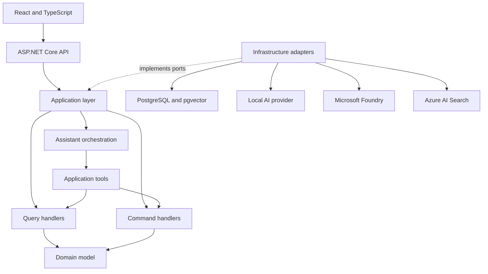

# Architecture overview

## System goal

ContractIQ combines structured contract data, unstructured documents, deterministic business rules, retrieval-augmented generation, and safe tool calling in a small modular monolith.

## Logical boundaries

### Contract Operations

The core domain owns customers, contracts, termination terms, cancellation assessments, and cancellation requests. It is the authority for dates, penalties, validation, state changes, and invariants.

### Knowledge

The knowledge module owns document ingestion, versioning, chunking, embeddings, indexing, retrieval, and citations. It never decides whether a contract can be cancelled.

### Assistant orchestration

Assistant orchestration resolves user intent, calls queries and commands through explicit application tools, retrieves supporting evidence, and generates a bilingual response. It is an application concern rather than a separate service.

## Dependency rule

- `Domain` has no infrastructure dependencies.
- `Application` references `Domain` and defines use cases and ports.
- `Infrastructure` implements application ports.
- `Api` is the composition root and transport boundary.
- `Web` communicates with the API over HTTP.

## CQRS approach

Commands and queries use separate request and handler types, but share the same process and PostgreSQL database. Endpoints inject handlers directly. The MVP does not use a mediator, message bus, separate read database, event sourcing, generic repository, or artificial unit of work over Entity Framework Core.

## AI safety boundary

The model may choose a tool. It cannot authoritatively calculate a penalty, validate a cancellation, assign a status, authorize a user, or write directly to the database. State-changing tools require explicit confirmation and execute application commands that recalculate and validate all business rules.

Retrieved document content is untrusted data. Instructions inside a document cannot change system behavior or enable tools.

## Execution profiles

- `Demo`: no Azure account and no local model requirement.
- `LocalAi`: local chat and embeddings without Azure token costs.
- `Azure`: optional Microsoft Foundry and Azure AI Search adapters.

The default developer experience remains functional without Azure.

