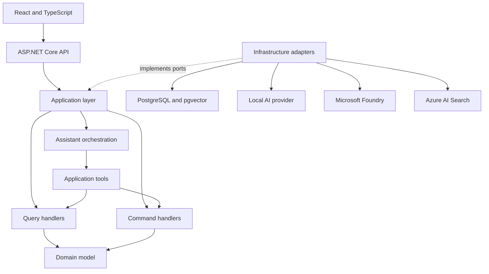

# Architecture overview

## System goal

ContractIQ combines structured contract data, unstructured documents, deterministic business rules, retrieval-augmented generation, and safe tool calling in a small modular monolith.

## Logical boundaries

### Contract Operations

The core domain owns customers, contracts, termination terms, cancellation assessments, and cancellation requests. It is the authority for dates, penalties, validation, state changes, and invariants.

The current deterministic rules are documented in [Contract cancellation rules](../domain/cancellation-rules.md).

### Knowledge

The knowledge module owns document ingestion, versioning, chunking, embeddings, indexing, retrieval, and citations. It never decides whether a contract can be cancelled. Its application ports are provider-neutral; the current local adapters use Ollama for multilingual embeddings and PostgreSQL for lexical and vector retrieval.

Customer, contract, and effective-date filters are applied before ranking. PostgreSQL lexical and cosine-similarity candidate lists are fused with Reciprocal Rank Fusion. See [Local knowledge retrieval](../knowledge/local-retrieval.md) for the concrete flow and trade-offs.

### Assistant orchestration

Assistant orchestration is an application concern rather than a separate service. The current read-only flow validates customer and contract scope, calculates the deterministic cancellation assessment, retrieves supporting evidence, refuses when no applicable contract clause is available, and asks a provider-neutral answer generator for a bilingual explanation.

The provider adapter uses Microsoft's `IChatClient` through either local Ollama or the OpenAI-compatible Kimi API. The committed default remains local and hosted usage is explicitly enabled with secret configuration. Citations are assembled by the application from retrieved metadata rather than invented by the model. `FunctionInvokingChatClient` exposes scoped read and preparation tools; the write tool remains outside automatic invocation and requires a separate confirmed HTTP request.

## Dependency rule

- `Domain` has no infrastructure dependencies.
- `Application` references `Domain` and defines use cases and ports.
- `Infrastructure` implements application ports.
- `Api` is the composition root and transport boundary.
- `Web` communicates with the API over HTTP.

## CQRS approach

Commands and queries use separate request and handler types, but share the same process and PostgreSQL database. Endpoints inject handlers directly. The MVP does not use a mediator, message bus, separate read database, event sourcing, generic repository, or artificial unit of work over Entity Framework Core.

## AI safety boundary

The model may choose a tool. It cannot authoritatively calculate a penalty, validate a cancellation, assign a status, authorize a user, or write directly to the database. State-changing tools require explicit confirmation and execute application commands that recalculate and validate all business rules. Tool audit events contain identifiers, tool name, outcome, timestamp, and state-changing classification, but never prompts or document content.

Retrieved document content is untrusted data. Instructions inside a document cannot change system behavior or enable tools.

## Execution profiles

- `Demo`: no Azure account and no local model requirement.
- `LocalAi`: local chat and embeddings without Azure token costs.
- `Azure`: optional Microsoft Foundry and Azure AI Search adapters.

The default developer experience remains functional without Azure.
